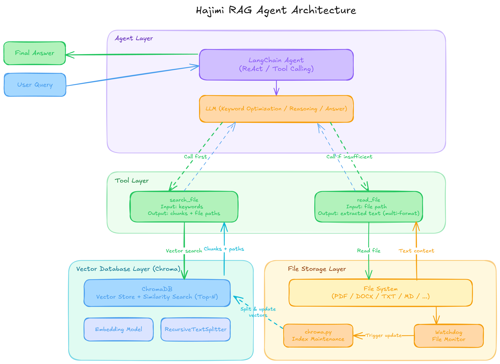

# 哈基米 RAG 架构

**哈基米 RAG** 是一个会"哈气"的智能问答系统——只要你的文件一有风吹草动，它立刻做出反应，始终保持知识库的新鲜与准确。

---

## 它能做什么？

你把文件丢进去，然后直接用自然语言提问。系统会自己去翻文件、找答案，最后用流畅的语言告诉你结果。不需要你指定看哪个文件，不需要你记得文件叫什么名字，它自己知道去哪找。

---

## 它是怎么工作的？

系统的核心是一个会思考的 **AI Agent**。它收到问题后，不会盲目乱翻，而是先想清楚该怎么找——

**第一步，先搜索。** Agent 把你的问题提炼成关键词，在知识库里快速定位最相关的内容片段，就像用搜索引擎，但更懂你的意思。

**第二步，按需深读。** 如果搜到的片段信息不够，它会顺着线索找到原始文件，把整个文件读一遍，补全缺失的细节。

**第三步，整合作答。** 收集到足够的信息后，它把内容梳理清楚，用自然语言给你一个完整的回答。

---

## 哈气的部分

这是哈基米 RAG 最有个性的地方。

系统在后台持续盯着你的文件夹。你加了一份新报告、改了一份合同、删了一个旧文档——它立刻感知到，立刻更新知识库，绝不让过时的信息混进回答里。

文件动，它就哈气。知识库永远和你的文件保持同步。

---

## 为什么叫"哈基米"？

因为哈基米不等人。文件一变，系统立刻做出反应——本能的、即时的、毫不犹豫的。快、准、带点野性。
