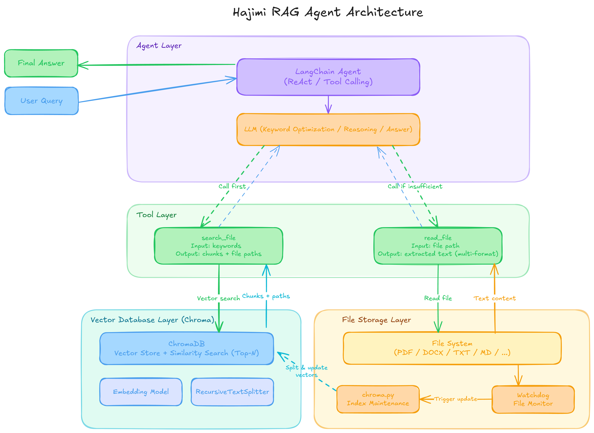

# 哈基米 RAG

哈基米 RAG 是一个智能且高效的文件问答系统——只要你的文件发生变化，它会立即更新知识库，确保每一次回答都最新、最准！

---

## 功能简介

- **智能问答**：直接用自然语言提问，系统自动阅读并检索文件，给你准确流畅的答案。
- **免记忆文件名**：无需指定文件、无需记住命名，提问即回答。
- **AI智能决策流程**：
  1. **关键词检索**——AI Agent 提炼问题核心，秒级定位相关内容。
  2. **深度阅读**——如需更多细节，自动调取原始文件，补全信息。
  3. **完整回答**——整合所有内容，以自然语言输出答案。
- **实时同步**：监控文件夹，自动感知文件新增/修改/删除，知识库实时更新，杜绝老旧内容。

---

## 系统架构

---

## 项目特色

- **自动哈气**：每当文件发生变动，系统立即“哈气”更新知识库，确保信息与文件同步，答案永不过时。
- **极致响应**：本能级的快与准，省心省力，适用于动态知识管理场景。

---

## 命名由来

哈基米，意在体现任务的敏锐和即时反馈——文件一有变化，系统立刻响应，快、准、带有野性。

---

如需进一步完善（如加“快速开始”、“贡献指南”等），或有其他特别需求，欢迎提出！